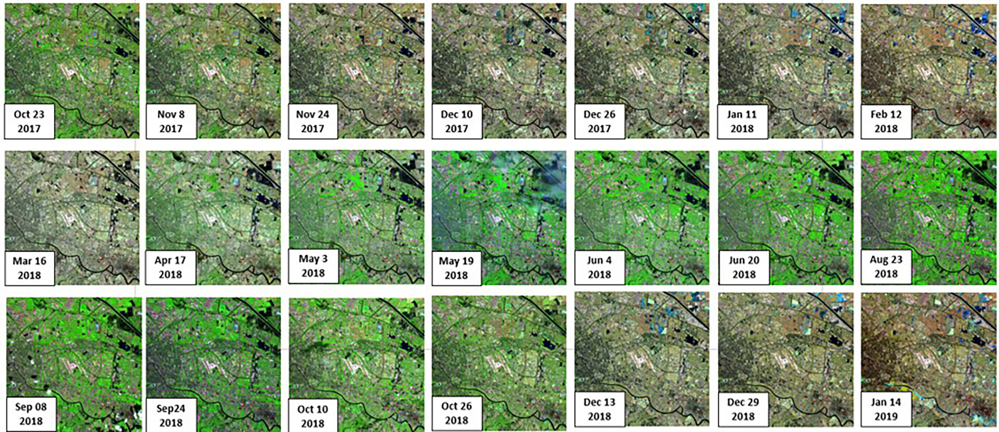

<!-- TOC -->

- [NormSITS](#normsits)
  - [License && Citation](#license--citation)
  - [0. Dependencies](#0-dependencies)
    - [0.1 GDAL](#01-gdal)
    - [0.2 PyQt](#02-pyqt)
    - [0.3 MySQL](#03-mysql)
    - [0.4 NumPy](#04-numpy)
  - [1. Functions](#1-functions)
  - [2. Build from source](#2-build-from-source)
  - [3. Experimental details of NMAG](#3-experimental-details-of-nmag)
    - [3.1 Obtain SITS](#31-obtain-sits)
    - [3.2 Choose Study Area](#32-choose-study-area)
    - [3.3 The Preparation of PIFs](#33-the-preparation-of-pifs)
    - [3.4 NMAG](#34-nmag)
      - [3.4.1 GA](#341-ga)
      - [3.4.2 The parameters of ANN](#342-the-parameters-of-ann)
      - [3.4.3 The ANN error convergence graphs](#343-the-ann-error-convergence-graphs)
      - [3.4.4 The Normalized results for SITS by using NMAG](#344-the-normalized-results-for-sits-by-using-nmag)

<!-- /TOC -->


# NormSITS

A cross-platform Satellite Images Time Series(SITS) preprocessing system.

## License && Citation
NormSITS is released under the terms of the BSD license, and thus free for commercial and research use. Feel free to normalized your own SITS,to add NormSITS in your own project. You are welcomed to make contributions to this project. Email zhyin@zju.edu.cn, or open an issue here on GitHub for support.

Citation (more to be added soon):

    @article{Yin_2021,
    title={A Nonlinear Radiometric Normalization Model for Satellite Images Time Series Based on Artificial Neural Networks and Greedy Algorithm},
    author={Yin, Zhaohui; Sun, Jiayu; Zhang, Haoran; Zhang, Wenyi; Zou, Lejun.; Shen, Xiaohua},
    journal={Preprints 2021, 2021010609}
    year={2021}
    }


## 0. Dependencies
### 0.1 GDAL

GDAL is a translator library for raster and vector geospatial data formats that is released under an X/MIT style Open Source [License](https://gdal.org/license.html#license) by the [Open Source Geospatial Foundation](https://www.osgeo.org/). As a library, it presents a single raster abstract data model and single vector abstract data model to the calling application for all supported formats. It also comes with a variety of useful command line utilities for data translation and processing. 

Version required: 2.3.3

### 0.2 PyQt
PyQt is a set of Python bindings for The [Qt Company's](https://www.qt.io/) Qt application framework and runs on all platforms supported by Qt including Windows, macOS, Linux, iOS and Android.

Version required: 5.9.2

### 0.3 MySQL
MySQL is the most popular relational database management system.

### 0.4 NumPy
The fundamental package for scientific computing with Python.

Version: 1.16.5

## 1. Functions
NormSITS provide a platform to handle the relative radiometric normalization of landsat-8 SITS.
In order to make users feel comfortable, NormSITS is designed to run in GUI mode. 

NormSITS include three main function:
1. Download Landsat-8 SITS、Landsat-7 SITS、Landsat-5 SITS.
2. Display each image in Landsat-8 SITS;
3. Clip landsat-8 SITS to obtain your own study area;
4. A nonlinear Radiometric Normalization Model for Satellite Imgaes Time Series (named NMAG) is implemented.

## 2. Build from source
Suggestion: 
>[Anaconda](https://www.anaconda.com) is a distribution of the Python and R programming languages for scientific computing (data science, machine learning applications, large-scale data processing, predictive analytics, etc.), that aims to simplify package management and deployment. The distribution includes data-science packages suitable for Windows, Linux, and macOS. With the help of Anaconda, you can easily build up the environment.

First, all dependencies, python, GDAL, PyQt, Numpy, MySQL, Pandas, Matplotlib should be installed properly.

Then, Run this Command:

```zsh
(gdal-python) Star@zhyin NMAG_Experiment % python ui_designer.py
```

After a successful compilation, NormSITS looks like this:


## 3. Experimental details of NMAG
### 3.1 Obtain SITS
SITS with 21 high-quality landsat-8 satellite images covering an area of Tianjin were used in this study. 

Users can Obtain SITS by following these steps:

    step1: LD -> Download Data;


    step2: SQL-CONNECT -> choose file "index.csv" -> connect to mySQL;


    step3: Fill in the attributes of SITS, such as CLOUD-MAX、START-TIME、END-TIME、PATH and ROW in the worldwide Reference System (WRS) and SPACECRAFT;
    step4: URL_ACQUIRE -> DOWNLOAD.

### 3.2 Choose Study Area
The cost time of performing relative radiometric correction on entire images in SITS is too long, thus only 1000*1000 pixels were selected as the study area.

Users can choose study Area by following these steps:

    step1: LD->clip;


    step2: Choose SITS Directory;
    step3: Fill in the longitude and latitude of the center pixel in study area, and then fill in the radius of study area;
    step4: choose Band;
    step5: Fill in the storage directory of the result.

After a successful compilation, the false color composite image of the study area is shown in the following figure.


### 3.3 The Preparation of PIFs
PIFs refer to pixels with constant radiometric value in SITS, which were mainly selected from artificial buildings, roads or bare ground pixels.

Users can obtain PIFs by following these steps:

    step1: LT -> PIFs Select


    step2: Input_MatDir -> choose the xxx.mat which is obtained in Sec2.2;
    step3: Click 'slopes', and wait a few minutes until button 'PIFs Extract' is enabled.
    step4: Input the range of slope;
    step5: Fill in the storage directory of the result.
After a successful compilation, The extraction results of PIFs are shown in the following figure. white pixels represent PIFs, with a total of 12,515 pixels. Of these, 8760 pixels are training samples and 3755 pixels are testing samples.


### 3.4 NMAG
A nonlinear Radiometric Normalization Model for Satellite Imgaes Time Series (named NMAG) based on Artificial Neural Networks (ANN) and Greedy Algroithm (GA) is implemented by these steps:
    
    step1: LT -> NMAG;
    step2: Train model;
    step3: Test model;
    step4: Obtain normalized SITS in the study area;
    step5: Save the False-color composite image of normalized SITS in the study area.
The GUI of NMAG is shown in the following figure:


In the method, GA was used to determine the correction order of SITS and calculate the error between the image to be corrected and corrected images, which avoided the selection of a single reference image. ANN was used to obtain the optimal solution of error function, which minimized the radiometric distortion between images in SITS.

#### 3.4.1 GA
A greedy algorithm is a simple, intuitive algorithm that is used in optimization problems. The algorithm makes the optimal choice at each step as it attempts to find the overall optimal way to solve the entire problem. 

#### 3.4.2 The parameters of ANN
- Example : 
- Normalize the image acquired in Nov 8,2017 by using NMAG. The parameters of ANN are shown in the following table:
- <b>p.s.</b> In order to reduce the cost time of model training, The DN value (0-65535) is transformed into top-of-atmosphere(TOA) reflectance value (0-1). 

<center>

$TOA_n = DN_n * REFLECTANCE\_MULT\_BAND\_n  + REFLECTANCE\_ADD\_BAND\_n$ 

</center>

|Iteration|Input Layer|Hiden Layer|Output Layer|Loss|Training Sample|Training RMSE|Testing Sample|Testing RMSE|
|:-:|:-:|:-:|:-:|:-:|:-:|:-:|:-:|:-:|
|1000|1|10|1|0.8281|8760|0.0117|3755|0.0115


#### 3.4.3 The ANN error convergence graphs 
- Example : 
- Normalize the image acquired in Nov 8,2017 by using NMAG. The ANN error convergence graphs is shown in the following figure:


#### 3.4.4 The Normalized results for SITS by using NMAG
After a successful compilation, The normalized results for SITS by using NMAG are shown in the following figure:
